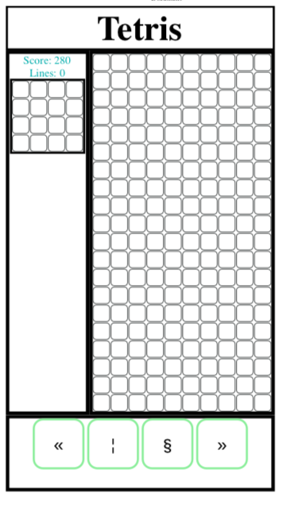
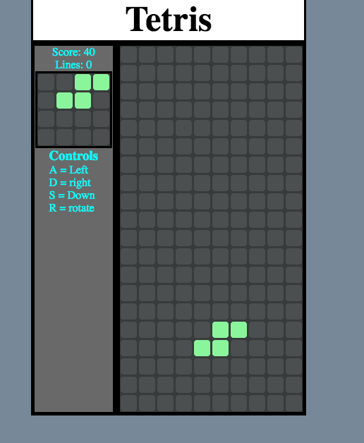

# TetrisGame
### Desscription
A game of tetris using js css and html. It is designed to play fast by making the drop unmanagable by filling 15 lines.
### Playing
[gameplay](https://garryc5.github.io/TetrisGame/)
### Usage 
On moblie 4 buttons will display just below the game board: in order, left, drop, spin, right.
On pc the controls will display in the side bar. 
There 
a: left
s: down
d: right
r: spin
### Mit license
^^I think go nuts.
### Preveiw Images

### Next Steps 
* aniemate the game over screen 
